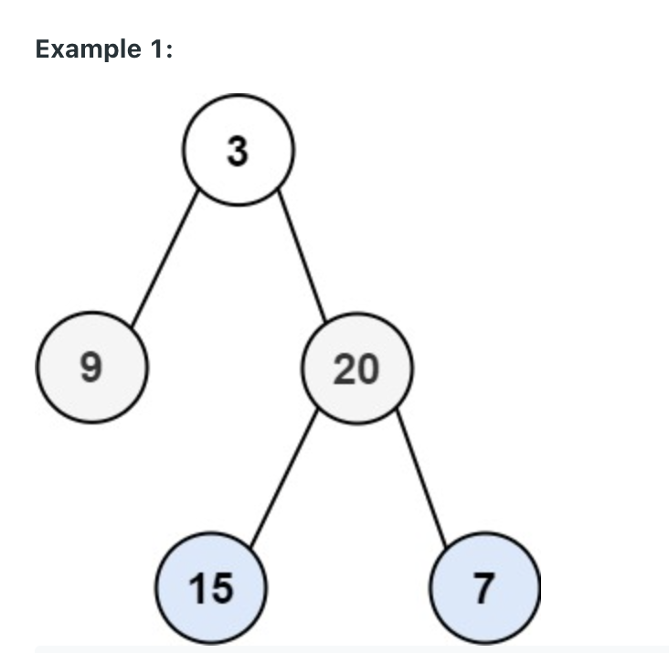
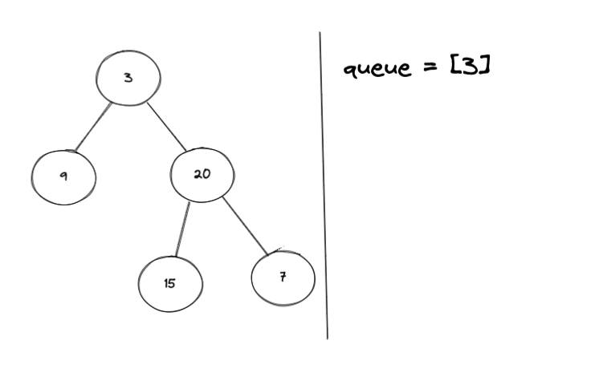
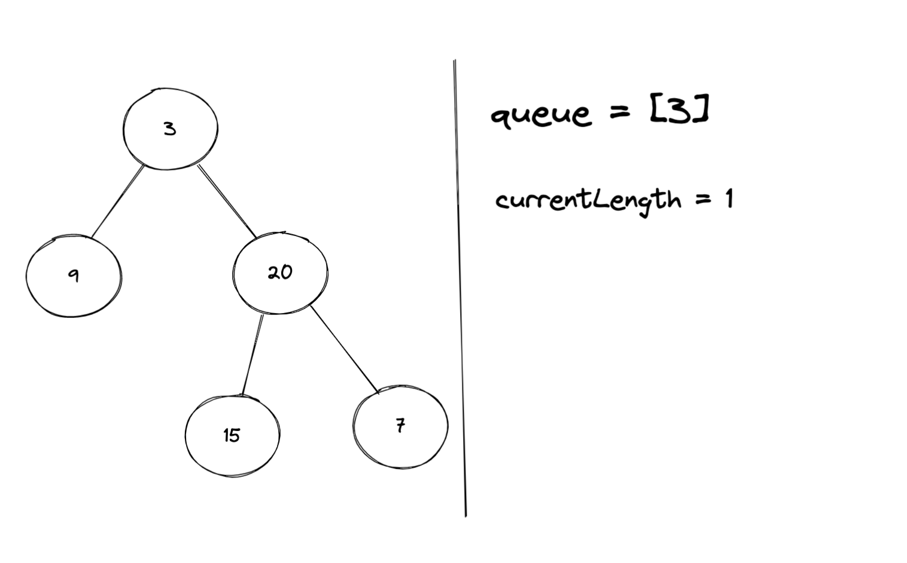
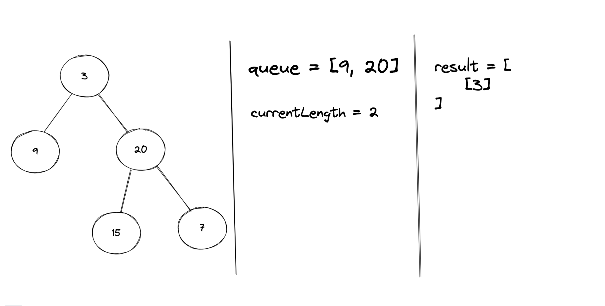

Solving LeetCode 102. Binary Tree Level Order Traversal. [Click here](https://leetcode.com/problems/binary-tree-level-order-traversal/) and try it out your self!


### LeetCode Problem Statement

Given the root of a binary tree, return the level order traversal of its nodes' values. (i.e., from left to right, level by level).

Example:

Example 1 Image:


```javascript
Example 1:
Input: root = [3,9,20,null,null,15,7]
Output: [[3],[9,20],[15,7]]

Example 2:
Input: root = [1]
Output: [[1]]

Example 3: 
Input: root = []
Output: []
```
 
### Initial Thoughts

Breadth First Search! 

### Breaking it down

We can use BFS to traverse the tree and collect all the nodes for a given level in a currentLevel array. We can store each of our currentLevel arrays in an results array. Once we finish our traversal our solution should be contained in results.

If your not familiar with how to implement BFS, continue to read on here. We'll describe BFS implementation as it
relates to this problem. If you are familiar feel free to skip. 

#### Implementing BFS

We can use a queue, while loop, and for loop to implement BFS. Typically a queue and a while loop are required, 
however the for loop is optional depending on the problem. Also, remember this is just one way to do this. 

To kick things off we will initialize a queue with the root node. We will continue to iterate through the queue
while it's not empty.



As we iterate in our while loop we will capture the current length of the queue. 
This length represents the number of nodes at the current level. Looking at our example, 
for the first iteration currentLength will equal one. The next time it will equal two, and the 
last iteration it will equal two again. This will become more clear as we continue to work through the problem. 



Storing currentLength is critical here. That's the information that lets us know the bounds of each level so we can operate on nodes on a level by level fashion.

> Important Note. Make sure to save currentLevel as a variable, and don't use queue.length. As you will
> see we are always adding child nodes to the queue so the length will change.

Every node we grab in the for loop will belong to the currentLevel. For this problem we are asked to collect
each level and return it in an array. So every time we shift() from our queue, we can 
push the value to the currentLevel.

To collect the next level, we will check if the current node has children. If it does, we will push them to the queue. 

Once the iteration finishes, our queue should have the next level and our result should have the first level.



Following these steps, we will collect all the levels! Nice.


### The Algorithm Plan

Approach Overview
* If there is no root, return []
* Initialize a queue with the root node
* Initialize a results array
* While the queue is not empty
  * Initialize a currentLevel array
  * Capture the currentLength of the queue
  * Declare a for loop, and iterate through the queue from 0 to the currentLength
    * Shift() from the queue
    * If node.left, push node.left to the queue
    * If node.right, push node.right to the queue
    * push node.val to the currentLevel
  * push currentLevel to results
* Return results

### Code

```javascript

const levelOrder = (root) => {

    if (!root) return []

    const results = [];
    const queue = [root];

    while (queue.length > 0) {
        const currentLength = queue.length;
        const currentLevel = [];

        for(let i = 0; i < currentLength; i++) {
            const node = queue.shift();
            if (node.left) {
                queue.push(node.left);
            }
            if (node.right) {
                queue.push(node.right);
            }
            currentLevel.push(node.val);
        }

        results.push(currentLevel);
    }

    return results;
}
```

### Summary

The time complexity of this Algorithm is O(N) since we are visiting every node in the tree. 
The space complexity will be O(N) + O(K), where K is the level with the most nodes. This 
represents the biggest size that our queue could be. 

Another interesting piece here is the queue that we are using. In my solution I am just using a 
normal JS array. This works like a queue in terms of the operations, but does not give us the 
performance we could get from a true queue implementation. Analyzing this piece is beyond the 
scope of this blog post, but it's important to call it out.

Hope you found this helpful! 

