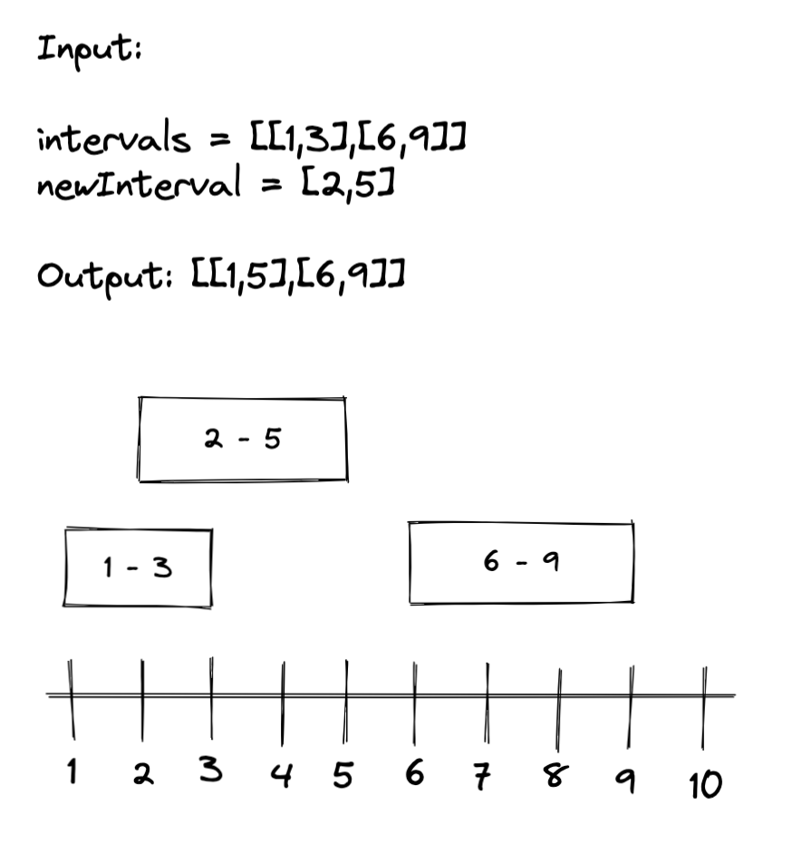
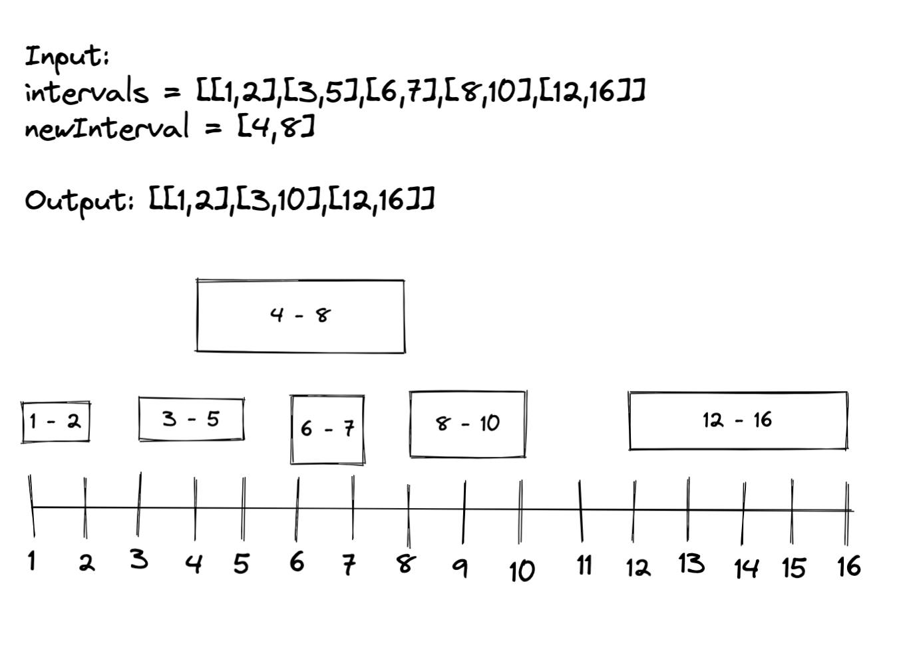
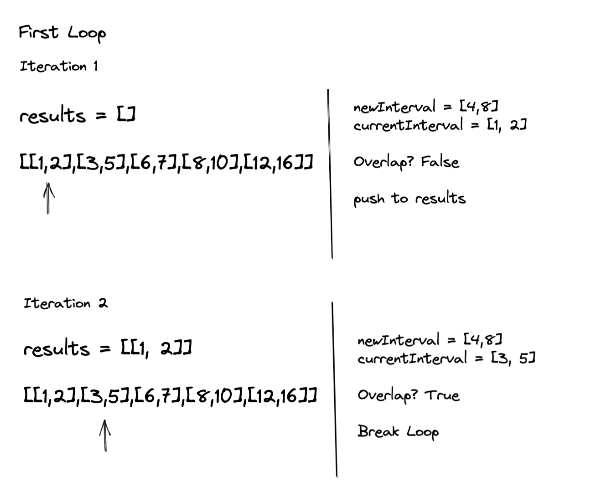
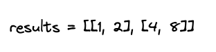
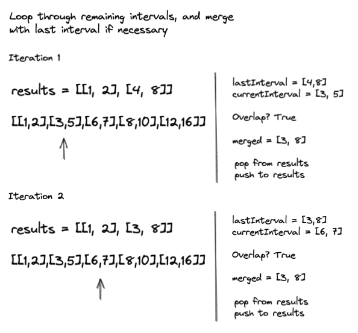
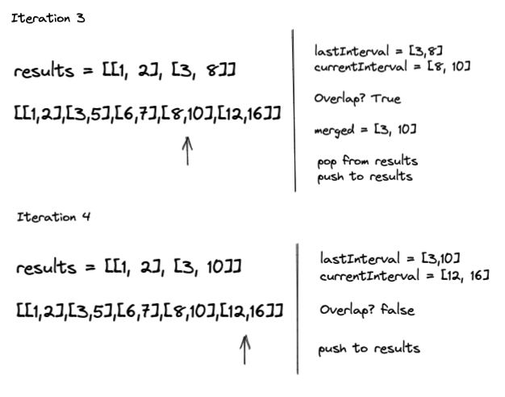

Solving LeetCode 57, Insert Interval. [Click here](https://leetcode.com/problems/insert-interval/) and try it out your self!

### LeetCode Problem Statement

You are given an array of non-overlapping intervals intervals where intervals[i] = [starti, endi] represent the start and the end of the ith interval and intervals is sorted in ascending order by starti. You are also given an interval newInterval = [start, end] that represents the start and end of another interval.

Insert newInterval into intervals such that intervals is still sorted in ascending order by starti and intervals still does not have any overlapping intervals (merge overlapping intervals if necessary).

Return intervals after the insertion.

Examples:

```
Input: intervals = [[1,3],[6,9]], newInterval = [2,5]
Output: [[1,5],[6,9]]

Input: intervals = [[1,2],[3,5],[6,7],[8,10],[12,16]], newInterval = [4,8]
Output: [[1,2],[3,10],[12,16]]
Explanation: Because the new interval [4,8] overlaps with [3,5],[6,7],[8,10].
```

### Initial Thoughts 
Brute force: push the new interval, then sort by start time 
and merge all the remaining intervals. The data is already sorted though... can we use that to make this more efficient?

> Draw a timeline diagram for sure. Doing that is one of the most helpful things 
> when solving these interval problems.

### Breaking it down

Lets look at the example:



From looking at this, we can figure out that the right spot to 
insert the interval is between the first and second interval in the
list. 

> So to find the insertion point, we have to find the first interval that overlaps with the new interval

Lets look at the second example:



So we can find our insertion point by iterating through the intervals and checking if the new interval overlaps with the current one we are iterating through. 

Notice how the intervals before the insertion will stay as is. They will not be subject to merge. However, all the intervals after insertion may be subject to merge. 

> With this in mind, we could iterate through the intervals while there is no
> overlap with the new interval, and push intervals into a results array. Then we can iterate through the remaining values, merge if necessary, and push into the results array.

Let's step through it:



Once the loop breaks we can push the new interval into the results.  



From here this will resemble a merge interval problem. We can iterate through the remaining intervals, and merge when we have to. If you are not familiar with this problem, I highly recommend that you work on that first.

Stepping through the second half:






Lastly, return our results:


Nice

### The Algorithm Plan

The algorithm will be broken into three parts:

Part 1
* Iterate through intervals while current interval does not overlap with new interval
* Push interval into results array

Part 2
* We have found the insertion point, push new interval into results array

Part 3
* Iterate through the remaining intervals
* If currentInterval and lastInterval overlap
  * Merge intervals
  * Pop from results
  * Push merged into results
* If they do not overlap
  * Push into results
* Increment the currentIdx

Finally, return results

Ok, lets code it up!

### Code

```javascript

const insert = (intervals, newInterval) => {
    
    let results = [];
    let currentIdx = 0;

    // Part 1
    while (intervals[currentIdx] && intervals[currentIdx][1] < newInterval[0]) {
        results.push(intervals[currentIdx]);
        currentIdx++;
    }

    // Part 2
    results.push(newInterval);

    // Part 3
    while(currentIdx < intervals.length) {
        let lastInterval = results[results.length - 1];
        let currentInterval = intervals[currentIdx];
        if (lastInterval[1] < currentInterval[0]) {
            results.push(currentInterval);
        } else {
            let merged = [
                Math.min(currentInterval[0], lastInterval[0]),
                Math.max(currentInterval[1], lastInterval[1])
            ]
            results.pop();
            results.push(merged);
        }
        currentIdx++;
    }

    return results;
}

```

### Summary

I remember when first attempting this, it was really hard to wrap my head around. The biggest thing that has helped me with interval problems in general is remembering the following:

> Non overlapping cases are easier to identify than overlapping cases

This is key from an implementation stand point. It's must easier to write code to determine if intervals don't overlap, versus the cases that they do. Good way to see this for your self is to draw some diagrams, and identify all the ways that two intervals can overlap, and all the ways that they won't. Highly recommend that you explore this. 

Thanks for reading. Hope this was helpful!

