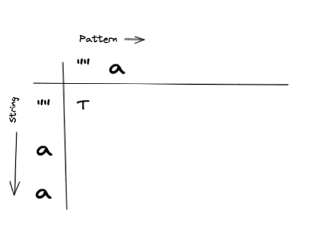
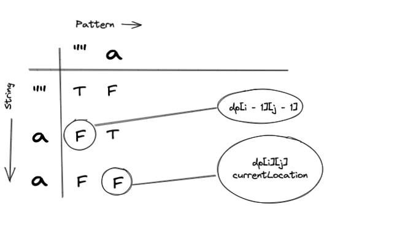

Solving LeetCode 10, Regular Expression Matching with Dynamic Programming. [Click here](https://leetcode.com/problems/regular-expression-matching/) and try it out your self!

To get the most out of this post I recommend you read my [original post](https://www.deepdevblog.com/regular-expression-matching/) that covers the analysis and the recursive solution. We will use that analysis and focus on how we can implement a solution using Dynamic Programming.

### LeetCode Problem Statement

Given an input string s and a pattern p, implement regular expression matching with support for '.' and '*' where:

'.' Matches any single character.​​​​
'*' Matches zero or more of the preceding element.
The matching should cover the entire input string (not partial).

Examples:

```
Input: s = "aa", p = "a"
Output: false
Explanation: "a" does not match the entire string "aa".

Input: s = "aa", p = "a*"
Output: true
Explanation: '*' means zero or more of the preceding element, 'a'. Therefore, by repeating 'a' once, it becomes "aa".

Input: s = "ab", p = ".*"
Output: true
Explanation: ".*" means "zero or more (*) of any character (.)".
```

### Breaking it down
Lets understand how we can apply Dynamic Programming to solve this problem. If you are not familiar with Dynamic Programming at all, I'd recommend that you learn the basics first before diving into this post. 

#### Analysis Recap

When we have an exact match, move on to the next character. An exact match can happen in two ways:
1. Characters match exactly
2. Pattern contains a "."

If the next character ahead is a "*" we have to asses the remainder of the string in one of two ways:

1. Match zero characters of the preceding character in the pattern
2. Match one or more characters of the preceding character in the pattern

#### Applying Dynamic Programming

Dynamic Programming is described as solving a problem bottom up. The core strategy is as follows:

* Identify your base cases (Solutions for small sub problems that you already know)
* Build solutions for small sub problems from base cases
* Use the previous solutions to build solutions for more complex cases, and so on

This will become more clear as we get into the implementation of the algorithm.

To keep track of all of these sub problems we will use a matrix. We'll refer to this as our DP table. Using a matrix is fairly common in Dynamic Programming although other data structures could be used as well.

#### Example one


##### Structuring our DP Table

To structure our table we need to answer the following:

What are our base cases? They will be the following:
* Empty Pattern, Empty String
* Empty Pattern
* Empty String

What kind of values will our table store? We can build a table of 
boolean values. If the sub string and sub pattern match, we can tag it with True,
otherwise False

As we iterate through we will be referencing our table for solutions to previous sub problems. We will use those solutions to solve our current problems, and use solutions to current problems to solve the next problems, and so on. Working in a bottom up fashion!

With that in mind, this is what our table would look like:


> Important Note: I chose to place the pattern on the X axis and the string in the Y axis.
> You can orient the table however you want, but be mindful of how you orient your inputs since it will affect
> how you search your table.

##### Populating our base cases

Before iterating through and solving for sub problems we need to initialize our table with the
solutions to our base cases. These cases represent the small sub problems that we already know the
answer to. Just like in a recursive algorithm, dynamic programming will build our solution based on
these sub problems.

**Base Case 1:** Empty String, Empty Pattern <br/>
If we have an empty string and an empty pattern, that should evaluate to true. Which would look like this:



**Base Case 2:** Empty Pattern <br/>
If we have an empty pattern, and a non empty string, that would look like this:


**Base Case 3:** Empty String <br/>
If we have an empty string, and a non empty pattern, that would look like this:


##### Iterating through

Once our table is set up, we can start to iterate through and 
populate the rest of our table. Once we are done, our answer should exist
in ```dp[s.length][p.length]```.

For Dynamic Programming problems, I find it incredibly helpful to have your 
core logic written out ahead of time. This way as you are manually stepping
through you can validate it, and make adjustments if necessary. 

With that said, our core logic should look like this:


DP solutions can be very unreadable sometimes when everything is being read directly from the table. I've added variables here to help with that. This makes things a bit more verbose but I hope that it makes it clearer. 

You should be able to come up with the core logic from the initial analysis of the problem. The challenging part will be figuring out where to look in the table. If you are still getting used to Dynamic Programming like I am, the best way to understand where to look is to work out a few problems. In this case I have done that ahead of time.

**Lets start looping through:**

```
i = 1
j = 1

sChar = s[i - 1] // a
pchar = p[j - 1] // a
```

> Notice how we are looking at the previous character. This makes things a bit
> more convenient to populate our table. This is because our table is taking into account the
> base cases which adds a character to the string and the pattern respectively. 

Ok, so we have a match! Lets check our DPTable to check the solution to the previous sub problem.


As we can see in this case, we have hit our base case, Empty String, Empty Pattern. So we can tag this cell with True.

After the update our table would look like this:


Nice!

**Moving on to the next iteration**

Since we don't have any more characters in the pattern, we would move on to

```
i = 2
p = 1
```

This is what it would look like from the table perspective:


```
s[i - 1] === p[j - 1] ? 
"a" === "a" ?
```

We have a match! Lets check our DPTable to check the solution to the previous sub problem.


Our DPTable indicates that our previous sub problem was not solved successfully. We hit our base case 2(Empty Pattern). So we would tag this cell with False.



At this point we would break out from our loops, since i == 3. Our answer will exist in ```dp[s.length][p.length]``` and as we can see it's False as we expected. 

Nice!

#### Example Two


Ok, working through example two, we should learn how to handle the "*" character. Lets 
get started by building our table with our base cases:


Populating our base cases

**Base Case 1:** Empty Pattern, and Empty String


**Base Case 2:** Empty String

How does an empty string match with a single "*" pattern?

Remembering the definition of "*", we can match zero or more of the preceding character. Since our base case is an empty string it eliminates the option of matching one or more of the preceding character. That leaves us with matching zero characters. To do that we would look at the value in ```dp[i][j - 2]``` which is our base case (Empty String, Empty Pattern). So we would tag this cell with True. 

> We will have to remember to add this logic when building our base cases


It's easy to get tripped up on this piece, I sure did! Let's dive a little deeper to make sure that this makes
sense by looking at an example. 

The pattern "a*" is looking to match strings that:
* Have one or more "a"s
* Have zero "a"s

Empty strings, have zero "a"s. So this checks out. 

> Tip: Dive deeper when you get tripped up. Understanding the details will set you up for success. Brushing over them could leave you blind sided in the next steps!

**Base Case 3:** Empty Pattern


Nice, table is ready!

**Iteration One**

Starting point will be:

```
i = 1
j = 1 

s[i - 1] === p[j - 1] ? 
"a" === "a"
```

We have a match. Lets check our DPTable to check the solution to the previous sub problem.


As we can see we hit our base case 1 (Empty String, Empty Pattern). We can tag this cell with True.

**Iteration Two**

```
i = 1
j = 2

s[i - 1] === p[j - 1] ? 
"a" === "*"
```

Our first star case! Lets check our DPTable to check the solution to the previous sub problem.


In this case we can see that ```matchZero``` hits our base case 2 (Empty Pattern), which is not a successful solution.

Since ```previousCharMatch``` is true, we can explore ```matchingOneOrMore``` which was solved successfully. So we can tag with cell with True.

**Iteration Three**

```
i = 2
j = 1

s[i - 1] === p[j - 1] ? 
"a" === "a"
```

We have a match. Lets check our DPTable to check the solution to the previous sub problem.


We would tag this cell with False since we hit base case 3 (Empty Pattern).

**Iteration Four**

```
i = 2
j = 2

s[i - 1] === p[j - 1] ? 
"a" === "*"
```

"*" Pattern again! Lets check our DPTable to check the solution to the previous sub problem.


Just like Iteration Two:

We can see that ```matchZero``` hits our base case 2 (Empty Pattern), which is not a successful solution.

Since ```previousCharMatch``` is true, we can explore ```matchingOneOrMore``` which was solved successfully. So we can tag with cell with True.


**Final Table**

Our final table will look like:


Our answer will be in ```dp[s.length][p.length]```, and as we can see it's True as expected. 

Nice!

#### Example 3

I'll leave it to you to work out example three. You should follow the same pattern we did in 
the previous two examples. The new character you will have to account for is "." which matches any
single character once. 

The best way to do this is to have the core logic available, and step through populating the table
cell by cell. This is precisely what our algorithm will do. A solid understanding of this process will make implementing the algorithm a breeze!


### The Algorithm Plan
Solve with Dynamic Programming

* Create DP table. Matrix of s.length + 1 by p.length + 1. Initialize with false values.
* Populate base cases
  * Empty String, Empty Pattern
  * Empty String
  * Empty Pattern
* Write nested for loop
  * Outer loop starting from 1 <= s.length
  * Inner loop starting from 1 <= p.length
    * In each iteration
      * If we have match
        * Check the previous string so far at ```dp[i - 1][j - 1]```
        * If the previous is True, tag this cell as True
      * If we have a "*"
        * MatchZero: ```dp[i][j - 2]```
        * If PreviousMatchChar
          * MatchZero or MatchOneOrMore: ```dp[i - 1][j]```
        * If either of these is True tag the cell as True. Otherwise False
* Once you break from the loop return ```dp[s.length][p.length]``` for the solution

### Code

```javascript

const array = (n) => { return Array(n).fill(false); }

const isMatch = (s, p) => {
    
    // Adding one to account for base cases
    const dp = array(s.length + 1).map(() => array(p.length + 1));

    // Base cases
    // Empty String Empty Pattern
    dp[0][0] = true;

    // Empty String
    for(let i = 1; i <= p.length; i++) {
        let pChar = p[i - 1];
        if (pChar === "*") {
            dp[0][i] = dp[0][i - 2];
        }
    }

    // Empty Pattern
    // We handle this by pre populating our matrix with false values

    // Iteration
    for(let i = 1; i <= s.length; i++) {
        for(let j = 1; j <= p.length; j++) {
            let sChar = s[i - 1];
            let pChar = p[j - 1];
            let stringMatchSoFar = dp[i - 1][j - 1];
            let currentMatch = sChar === pChar || pChar === ".";
            if (currentMatch) {
                dp[i][j] = stringMatchSoFar;
            }
            
            if (pChar === '*') {
                let matchZero = dp[i][j - 2];
                let previousMatch = sChar === p[j - 2] || p[j - 2] === ".";
                let matchOneOrMore = dp[i - 1][j];
                dp[i][j] = matchZero || (previousMatch && matchOneOrMore);
            }
        }
    }

    return dp[s.length][p.length];
}


```

### Summary

The time complexity of this algorithm is O(S * P) where S is the length of the string and P is the length of the pattern. The space complexity will be O(S * P) since we are storing solutions to sub problems in a matrix. Although Dynamic Programming solutions can be hard to think about the time complexity analysis is quite simple as you can see. 

Key takeaways:
1. Lay out your core logic ahead of time
2. Build your DP table manually by stepping through the problem and test your core logic 
3. Make adjustments to your core logic as needed as you step through

Once your core logic is solid, the rest of the implementation is fairly trivial as you can see. 

Hope you found this helpful!


