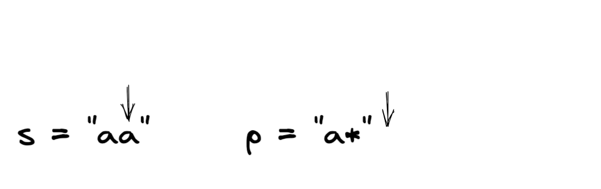

Solving LeetCode 10, Regular Expression Matching. [Click here](https://leetcode.com/problems/regular-expression-matching/) and try it out your self!

### LeetCode Problem Statement

Given an input string s and a pattern p, implement regular expression matching with support for '.' and '*' where:

'.' Matches any single character.​​​​
'*' Matches zero or more of the preceding element.
The matching should cover the entire input string (not partial).

Examples:

```
Input: s = "aa", p = "a"
Output: false
Explanation: "a" does not match the entire string "aa".

Input: s = "aa", p = "a*"
Output: true
Explanation: '*' means zero or more of the preceding element, 'a'. Therefore, by repeating 'a' once, it becomes "aa".

Input: s = "ab", p = ".*"
Output: true
Explanation: ".*" means "zero or more (*) of any character (.)".
```

### Initial Thoughts 
Hard problem.... What pattern can we apply to solve this?

### Breaking it down
Lets start breaking this down piece by piece, and looking at the examples. 

#### Example 1:


How can we approach this? We can iterate through and compare the characters. 
If they are equal, we can compare the next set of characters and so on. 


> In this example, we run out of characters for the pattern but still have characters in the string. 
> This scenario indicates we don't have a match. This is the case because we are looking for a full match, not partial. 

##### Takeaway
Once we reach the end of the pattern, we can check the length of the remaining string. If it equals zero,
we have a match. Otherwise, we do not.

#### Example 2:


##### Handling "*"
After walking through this example we should understand how to handle the case with
"*" in the pattern. 

> Definition of "*": Matches zero or more of the preceding character in the pattern. 

Reading the definition tells us we can match in two ways. 

1. We can have zero occurrences of the preceding character in the pattern
2. We can have one or more occurrences of the preceding character in the pattern

The solution could exist in option one, or option two. We would
have to explore both to know for sure. 

> Note: Whenever we run into problems where we need to explore multiple paths,
> recursion can be an effective tool. Uncovering this indicates that we could use
> recursion to solve this, and that's what we will be doing. If you are not familiar 
> with recursion, I'd recommend to learn the pattern first and then come back to this
> post. 

##### Stepping through the example

With recursion in mind, lets work through the example:


We can compare the first characters and see that they are equal. 

To identify if we have the "\*" we have to look ahead to the next character in "p". If it's
a "\*" we need to handle both our options.


##### Handling The First Case (Level 1)
**Case one**: Zero occurrences <br>
**Action**: Ignore the characters in "p" and skip ahead


Since we have reached the end of the pattern, but not the string, we would return false


##### Handling The Second Case (Level 1)
**Case two**: One or more occurrences of the preceding character <br>
**Action**: Move on to check the next character in "s"


Once we get here, we would compare the characters again. Since they match,
and the next character in p is "\*", we would explore our two cases again.

##### Handling The First Case (Level 2)
**Case one**: Zero occurrences <br>
**Action**: Ignore the characters in "p" and skip ahead



We would jump ahead in "p", but we would still have characters left in "s". So
this would evaluate to false.

##### Handling The Second Case (Level 2)
**Case two**: One or more occurrences of the preceding character <br>
**Action**: Move on to check the next character in "s"


We would jump ahead in "s" and reach the end of "s". We would still have
characters in "p" however. So, once again, we would check the next character in "p", 
identify the "\*" case, and explore the two cases. Deeper in the stack we go!

##### Handling The First Case (Level 3)
**Case one**: Zero occurrences <br>
**Action**: Ignore the characters in "p" and skip ahead


This time, we have reached the end of both strings, which means that we have a match, 
and would evaluate to true. 

##### Handling The Second Case (Level 3)
**Case two**: One or more occurrences of the preceding character <br>
**Action**: Move on to check the next character in "s"


Here we would move ahead in s, and be out of bounds. Since there is no character 
to compare here we would return false. 

> Note: We are exploring this case for completeness, but depending on how we 
> implement our algorithm we could just stop exploring once we find a true case.

##### Takeaway
Recursion will be a good approach to solve this since we have to explore two possible paths. 


#### Example 3


For this example we have "." This character indicates that we can match
any character. In this case it's followed by the "*" so we would apply the cases
we learned in the last example as well.

##### Handling The First Case (Level 1)
**Case one**: Zero occurrences <br>
**Action**: Ignore the characters in "p" and skip ahead


In this case we would run out of characters in "p", but we would still have characters in "s". 
So this case would evaluate to false

##### Handling The Second Case (Level 1)
**Case two**: One or more occurrences of the preceding character <br>
**Action**: Move on to check the next character in "s"


Since "." can equal any character, we would move ahead to the next character in "s". From there
we would evaluate our two cases again.

##### Handling The First Case (Level 2)
**Case one**: Zero occurrences <br>
**Action**: Ignore the characters in "p" and skip ahead


Like before, this would evaluate to false since we have ran out of characters in "p".

##### Handling The Second Case (Level 2)
**Case two**: One or more occurrences of the preceding character <br>
**Action**: Move on to check the next character in "s"


This case looks familiar from the previous example. We would move one character ahead in "s" since "." matches any character.
Once we get here, we can see that we will eventually evaluate to true, by exploring case number one: zero occurrences of the preceding
character in the next level of the stack. 

> Nice! Stepping through these examples have helped us understand the cases we will have to handle. Now
> that we have a good understanding of the problem, lets lay our thoughts out so we can code it up.


### The Algorithm Plan

Like we uncovered we will be using a recursive approach to solve the problem. 
With that in mind, lets identify our base cases

Bases Cases:
* If we reach the end of "p" and the end of "s" we have a match
* Evaluate firstMatch: Check if the first characters in "s" and "p" equal
* Check if the next character in "p" is a "*", if so:
  * Return
    * Case one: call the function by moving "p" ahead by two characters
    * OR
    * Case two: firstMatch AND call the function by moving "s" ahead by one character
* Return
  * firstMatch
  * AND
  * call the function by moving "s" up on character and "p" up one character

### Code

```javascript

const isMatch = (s, p, sIdx = 0, pIdx = 0) => {
    if (p.length === pIdx) {
        return s.length === sIdx;
    }

    const firstMatch = sIdx < s.length && (s[sIdx] === p[pIdx] || p[pIdx] === ".");

    if ((pIdx + 1) < p.length && p[pIdx + 1] === "*") {
        return (
            isMatch(s, p, sIdx, pIdx + 2) // Case One
            || firstMatch && isMatch(s, p, sIdx + 1, pIdx) // Case Two
        )
    }

    return firstMatch && isMatch(s, p, sIdx + 1, pIdx + 1);
}

```

### Summary

In the worst case, this algorithm runs in O((S + P) * 2^S + P/2), where S and P are the lengths of "s" and "p" respectively. 
This time complexity is very challenging to pin down. I'd recommend this [blog post](https://levelup.gitconnected.com/solving-for-recursive-complexity-736439987cb0) for
a deep dive. 

Working through this problem recursively is helpful to understand what is involved in figuring out the solution. 
However, the optimal solution to this problem can be achieved with Dynamic Programming. The Dynamic Programming solution to
this problem will run in O(S * P), which is much faster. 

If you are not familiar with Dynamic Programming it can be hard to wrap your head around at first. However, once you understand
how to apply the pattern, it can help you come up with performant solutions with minimal code. It's a very powerful pattern. 

I'd challenge you to take what we have learned and try to solve this problem with Dynamic Programming. I'll challenge my self
with that too!

Hope this was helpful!


