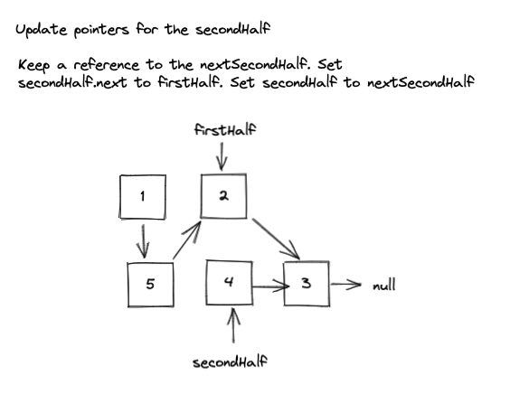
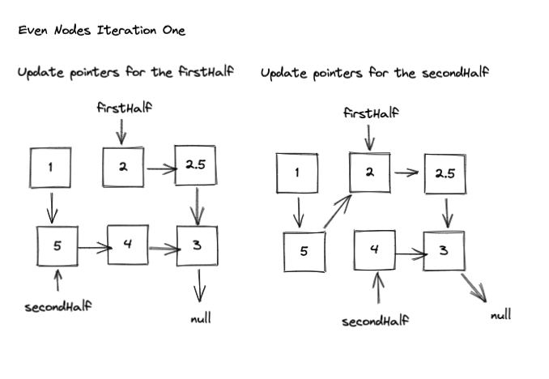

Solving LeetCode 143. Reorder List. [Click here](https://leetcode.com/problems/reorder-list/) and try it out your self!

### LeetCode Problem Statement

You are given the head of a singly linked-list. The list can be represented as:

```
L0 → L1 → … → Ln - 1 → Ln
```

Reorder the list to be on the following form:

```
L0 → Ln → L1 → Ln - 1 → L2 → Ln - 2 → …
```

You may not modify the values in the list's nodes. Only nodes themselves may be changed.

Examples:

```
Input: head = [1,2,3,4]
Output: [1,4,2,3]

Input: head = [1,2,3,4,5]
Output: [1,5,2,4,3]
```

### Initial Thoughts

Hmmm.... After some thought, it became clear that I'd have to solve a couple of sub problems. The way I realized this was by looking at the input and output, and walking through some examples by 
hand. Drawing things out by hand is recommended by mostly everyone, and with great 
reason. A tool that I have been using lately to do this is [excalidraw](https://excalidraw.com/). 
It's been super helpful. 

> So, Draw things!


### Breaking it down

Let's take an example:


It looks like we would like to re order the 
list in a way where we are interleaving the numbers 
from the end of the list into the beginning. 

The pattern would be to start with the last node,
5 in this case, and place it between the 1 and the 2. Then take the next last node, 4, and place it between the 2 and the 3. 

We have two sets of numbers. Set A, the set we will insert nodes into, and Set B, the nodes that we will insert into Set A. Since we are only given
one list however, we have to determine where one
set of number ends and the other begins. From the example above, we can see that the middle of the list is this spot. 

We can find the middle of the list, and then have 
two lists that we can work with. To find the middle of a linked list we can use the fast and slow pointer approach. With this approach we would end up with something like:


This looks like something we can work with. Although it will be hard to work with the second list since we want to start backward. This is a singly linked list so we don't have a reference to the previous node. 

What if it was reversed? Then our lists would look something like:


Instead of having two separate lists, we could have two lists that end on the same node. Something like this:


> Our algorithm implementation will be written expecting to operate on this data structure (two lists that end on a shared node). Keep this in mind. Disconnecting the two lists would work as well, but the implementation would be different.

So we will find the middle of the linked list, and reverse the second half. Once we get here we have to
figure out how to interleave the nodes of the two lists. This is the tricky part.

We can iterate through both the lists, and update the pointers as we go. Let's look at an overview of the process:


During iteration




Looks like things would work. Lets take a look at how our loop would break in this case:


As you can see, we end up in a situation where

```javascript
firstHalf = 3 -> null
secondHalf = 3 -> null
```

Following our algorithm

```javascript
let nextFirstHalf = firstHalf.next // null
firstHalf.next = secondHalf // 3, circular reference
firstHalf = nextFirstHalf // null

let nextSecondHalf = secondHalf.next // 3, circular reference
secondHalf.next = firstHalf // break circular reference, now 3 -> null
secondHalf = nextSecondHalf // 3, with no circular reference
```

In this case, things would just work once the loop breaks. Nice!

> But...... How would the loop break with an even number of nodes?

I've added a node to our example, lets pick it up and go through it to find out.




In this case, secondHalf would be null, and firstHalf.next would be pointing to itself. As you can see we end up with a cycle. 

To ensure we return a proper list without a cycle, we have to check to make sure that firstHalf.next equals null after the loop breaks. If it doesn't, set it to null to remove the cycle

> The last iteration is key here! This tripped me up for sure! 

### The Algorithm Plan

Steps we need to solve this problem from our breakdown analysis:

**Overview**
* Find middle of list
* Reverse second half
* Use to pointers to iterate through both lists, and interleave the nodes

**Finding the middle of the linked list**
* Use a two pointer approach
  * Previous pointer, Slow pointer, and Fast pointer
  * Once Fast reaches the end, Slow will be the middle node of the list

**Reverse the second half of the list**
* Write a helper function to reverse the list starting from the slow node
* The function should return the new head of this list, this value will be our secondHalf

**Interleave the nodes**
* Create a pointer for the firstHalf
* Iterate through while firstHalf and secondHalf are not null
* Update pointers for the firstHalf 
  * Store the nextFirstHalf
  * Set firstHalf.next to secondHalf
  * Set firstHalf to nextFirstHalf
* Update pointers for the secondHalf
  * Store the nextSecondHalf
  * Set secondHalf.next to firstHalf
  * Set secondHalf to nextSecondHalf
* Return head (Since we are just changing pointers, we can return the original head of the list we were given)


Alright, lets code it up!


### Code

```javascript

const reorderList = (head) => {
    
    // Find the middle
    let slow = head;
    let fast = head;

    while (fast && fast.next) {
        slow = slow.next;
        fast = fast.next.next;
    }

    // reverse second half
    let secondHalf = reverseList(slow);

    // interleave nodes
    let firstHalf = head;

    while (firstHalf && secondHalf) {
        // Update firstHalf pointers
        let nextFirstHalf = firstHalf.next;
        firstHalf.next = secondHalf;
        firstHalf = nextFirstHalf

        // Update secondHalf pointers
        let nextSecondHalf = secondHalf.next;
        secondHalf.next = firstHalf;
        secondHalf = nextSecondHalf;
    }

    // remove circular dependency if it exists
    if (firstHalf && firstHalf.next !== null) {
        firstHalf.next = null;
    }
    // return original head since we were just changing pointers
    return head;
}

const reverseList = (node) => {
    let prev = null;
    while (node) {
        let nextNode = node.next;
        node.next = prev;
        prev = node;
        node = nextNode;
    }
    return prev;
}
```

### Summary

This was an interesting problem. The solution I am using here is from educative.io. Using two linked lists that point to the same node wasn't something that came to my mind. This data structure makes the algorithm slightly nicer though. 

Without knowing that solution, disconnecting the lists is a more natural solution. The crux with that approach also reveals it self in the last iteration. You have to add some additional logic in the loop to handle some cases. 

I challenge you to give that a shot. Draw out a diagram and work through it slowly, iteration by iteration.

> Sometimes, you have to go slow to go fast!

Hope this was helpful!


