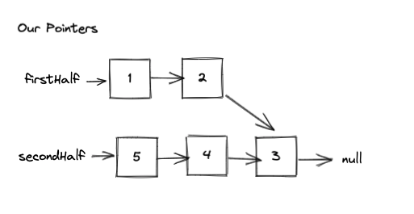

Solving LeetCode 143. Reorder List. [Click here](https://leetcode.com/problems/reorder-list/) and try it out your self!

### LeetCode Problem Statement

You are given the head of a singly linked-list. The list can be represented as:

```
L0 → L1 → … → Ln - 1 → Ln
```

Reorder the list to be on the following form:

```
L0 → Ln → L1 → Ln - 1 → L2 → Ln - 2 → …
```

You may not modify the values in the list's nodes. Only nodes themselves may be changed.

Examples:

```
Input: head = [1,2,3,4]
Output: [1,4,2,3]

Input: head = [1,2,3,4,5]
Output: [1,5,2,4,3]
```

### Initial Thoughts

Hmmm.... I see what I have to do, but not quite sure how I would get there.
After thinking it through a bit more, it started to become clearer that to 
solve this problem, I'd have to solve a couple of sub problems. The way I realized
this was by looking at the input and output, and walking through some examples by 
hand. Drawing things out by hand is recommended by mostly everyone, and with great 
reason. A tool that I have been using lately to do this is [excalidraw](https://excalidraw.com/). 
It's been super helpful. 


### Breaking it down

Let's take an example:


While examining this, we can start to see a bit of a pattern. It looks like we would like to re order the 
list in a way where we are interleaving the numbers 
from the end of the list into the beginning. 

The pattern would be to start with the last node,
5 in this case, and place it between the 1 and the 2. Then take the next last node, 4, and place it between the 2 and the 3. 

From this we can determine that we have two sets of numbers. The main set, and the set that we will be 
inserting into the main set. Since we are only given
one list however, we have to determine where one
set of number starts and the other begins. From the example above, we can see that the middle of the list 
is this spot. 

So we can find the middle of the list, and then have 
two lists that we can work with. To find the middle of a linked list we can use the fast and slow pointer approach. With that approach we would end up with something like:


> Note: For even nodes, both the lists would be the same length.

This looks like something we can work with. One challenge that becomes clear at this point is that it
will be hard to work with the second list since we want
to start backward. This is a singly linked list so we don't have a reference to the previous node. 

What if it was reversed? Then our lists would look something like:


So getting the input to look like this will involve finding the middle of the list that we are given, and reversing the second half. Once we get here we have to
figure out how to interleave the nodes of the two lists. This is the tricky part.

We can iterate through both the lists, and update the 
pointers as we go. Let's look at an overview of the process:



During iteration


From this we can see that we can iterate through, and update our two pointers. From this example we can see that we have to continue this process while both pointers are not null. 

Notice how this example we are working with an odd number of nodes. In this case firstHalf will be null, and secondHalf will not be. But the remaining secondHalf is in the right order. 

How would the loop break with an even number of nodes? I've added a node to our example, lets pick it up and go through it to find out. 


### The Algorithm Plan

Steps we need to solve this problem from our breakdown analysis:

* Find middle of list
* Reverse second half
* Use to pointers to iterate through both lists, and interleave the nodes

Finding the middle of the linked list
* Use a two pointer approach
  * Slow pointer, and Fast pointer
  * Once Fast reaches the end, Slow will be the middle node of the list

Reverse the second half of the list
* Write a helper function to reverse the list starting from the slow node
* The function should return the new head of this list, this value will be our secondHalf

Interleave the nodes
* Create a pointer for the firstHalf
* Iterate through while firstHalf and secondHalf are not null
* Update pointers for the firstHalf 
  * Store the nextFirstHalf
  * Set firstHalf.next to secondHalf
  * Set firstHalf to nextFirstHalf
* Update pointers for the secondHalf
  * Store the nextSecondHalf
  * Set secondHalf.next to firstHalf
  * Set secondHalf to nextSecondHalf
* Make sure the firstHalf is null, otherwise set firstHalf.next to null to remove the cycle. Happens for lists with even nodes.
* Return head (Since we are just changing pointers, we can return the original head of the list we were given)


Alright, lets code it up!


### Code

```javascript

const reorderList = (head) => {
    
    // Find the middle
    let slow = head;
    let fast = head;

    while (fast && fast.next) {
        slow = slow.next;
        fast = fast.next.next;
    }

    // reverse second half
    let secondHalf = reverseList(slow);

    // interleave nodes
    let firstHalf = head;

    while (firstHalf && secondHalf) {
        // Update firstHalf pointers
        let nextFirstHalf = firstHalf.next;
        firstHalf.next = secondHalf;
        firstHalf = nextFirstHalf

        // Update secondHalf pointers
        let nextSecondHalf = secondHalf.next;
        secondHalf.next = firstHalf;
        secondHalf = nextSecondHalf;
    }

    // Make sure there is no cycle if the original list had an even number of nodes
    if (firstHalf !== null) {
        firstHalf.next = null;
    }

    // return original head since we were just changing pointers
    return head;
}

const reverseList = (node) => {
    let prev = null;
    while (node) {
        let nextNode = node.next;
        node.next = prev;
        prev = node;
        node = nextNode;
    }
    return prev;
}
```

### Summary


