Solving LeetCode 25. Reverse Nodes in k-Group. [Click here](https://leetcode.com/problems/reverse-nodes-in-k-group/) and try it out your self!

### LeetCode Problem Statement

Given the head of a linked list, reverse the nodes of the list k at a time, and return the modified list.

k is a positive integer and is less than or equal to the length of the linked list. If the number of nodes is not a multiple of k then left-out nodes, in the end, should remain as it is.

You may not alter the values in the list's nodes, only nodes themselves may be changed.

Examples:

```
Input: head = [1,2,3,4,5], k = 2
Output: [2,1,4,3,5]


Input: head = [1,2,3,4,5], k = 3
Output: [3,2,1,4,5]
```

### Initial Thoughts

Linked Lists... For me, these problems are fairly easy to understand conceptually. The 
challenging part here is figuring out the implementation. With Linked Lists problems, keeping
track of pointers is key. And the less pointers you can keep track of, the easier it will be
to implement.


### Breaking it down

Lets look at an example and start working through it to understand what the implementation will look like.


#### Overview ####

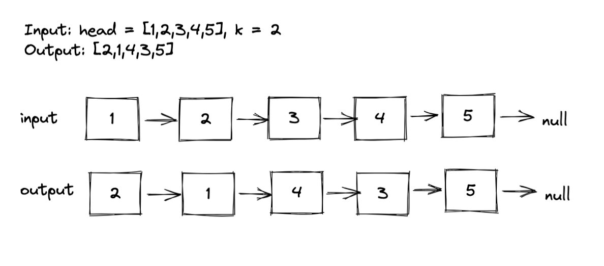

From looking at this we can see that we will need a way to count the nodes as we iterate through them. 
Once we get to k nodes, we will have to run some operations to reverse that sub list, and re-connect it. 
Once we do that, we can move on to the next k nodes.

#### What to do once you get to k nodes ####

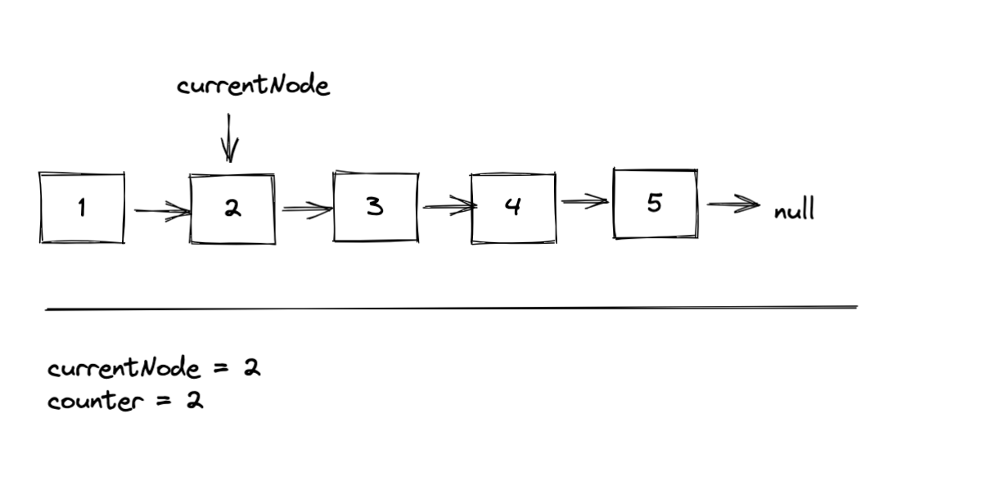

Once we get to the kth node we will need to reverse the list from 1 to 2. In order to reverse a list, we will need the startingNode. 
We will need a pointer to keep track of that. 

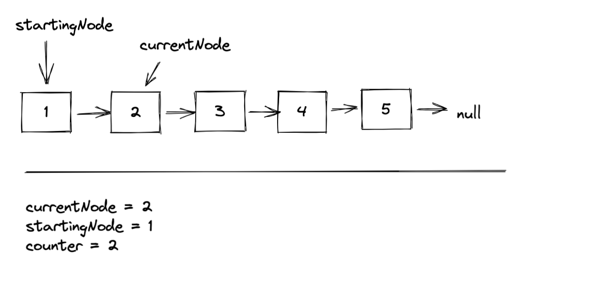

Then we can disconnect the list, and keep track of the rightHalf to re-connect.

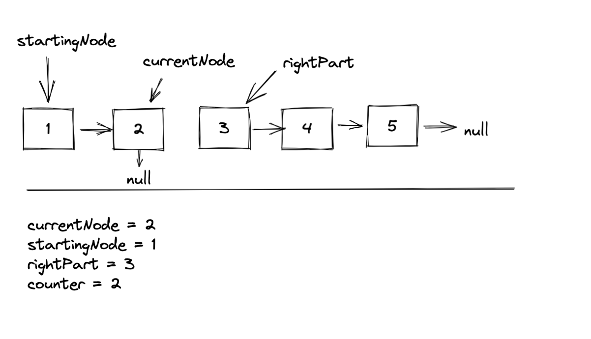

#### Reversing the sub-list ####

Now we can actually reverse the list. We won't be doing a deep dive on linkedList reversal here. If you aren't familiar with how to reverse a linkedList, 
I highly recommend you learn that first before diving into this problem.

Once we reverse the list we should have: 

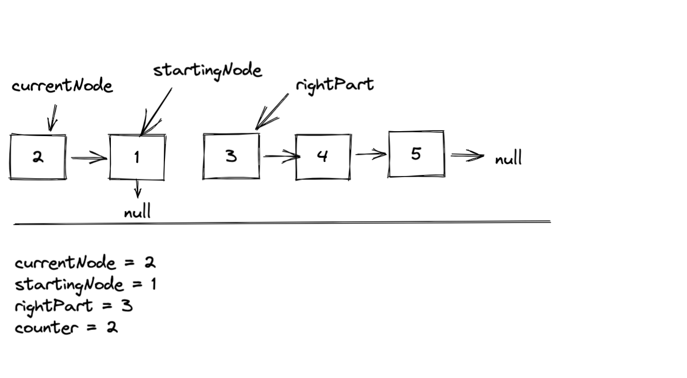


> Important observation here. Notice how starting node is now the tail of our subList, and currentNode is the head. 

#### Re-connecting the reversed sub-list to the main list and re-setting for the next iteration ####

To re-connect and reset we would run the following operations on our pointers:

```javascript
startingNode.next = rightPart
startingNode = rightPart
currentNode = rightPart
counter = 1
```

Resulting in:

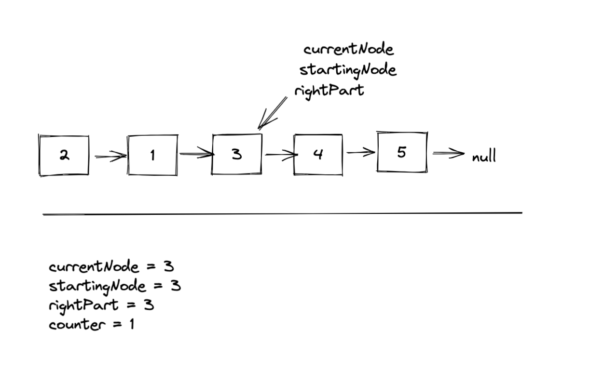

> Hmm ok, we have made some progress. There are two things that we are missing here though....

1. What about the leftPart?!
We haven't seen the leftPart come into action yet, but as you probably guessed we will have to handle this. To
handle this we will use a leftPart pointer.

1. What are we going to return once we are done?

We will have to return the newHead of the first subList. To handle this, we can....
you guessed it, use a newHead pointer. 

#### Re-connecting the reversed sub-list to the main list and re-setting for the next iteration with the leftPart and newHead ####

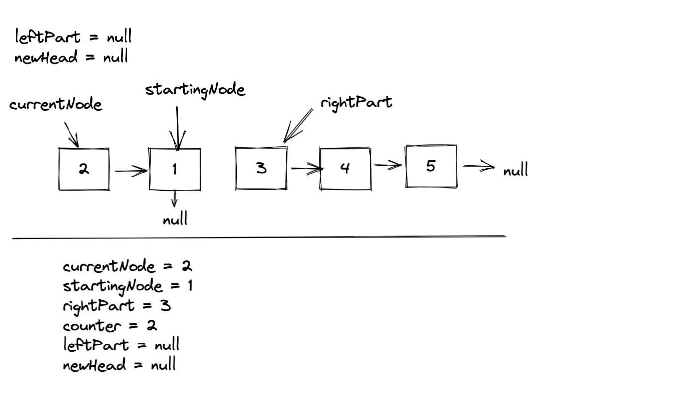

Then, we'll run the following operations...

```javascript
startingNode.next = rightPart // connect the list
newHead = currentNode // set the newHead, we will only do this once
leftPart = startingNode // save the leftPart for the next iteration
startingNode = rightPart // save the next startingNode
currentNode = rightPart // set up the next currentNode
counter = 1 // reset the counter
```

Then we'll be left with...

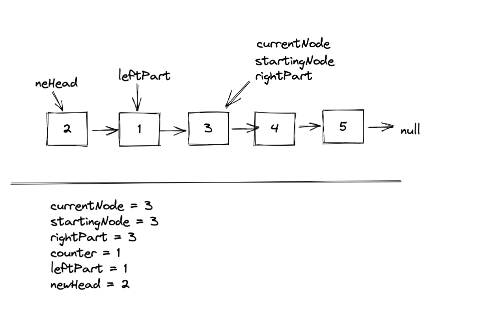

#### Re-connecting the reversed sub-list to the main list and re-setting for the next iteration in the middle of the list ####

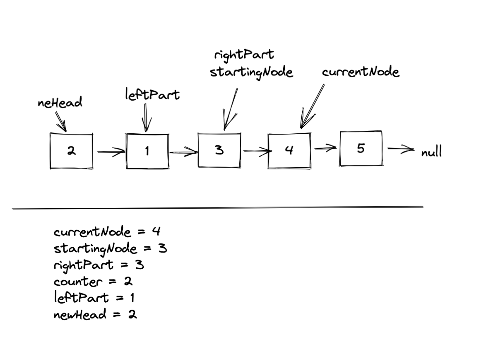

Disconnect the subList, and reverse it by running:

```javascript
rightPart = currentNode.next // save the rightPart
currentNode.next = null, disconnect from the main list
reverse(startingNode) // reverse the subList
```

Resulting in...

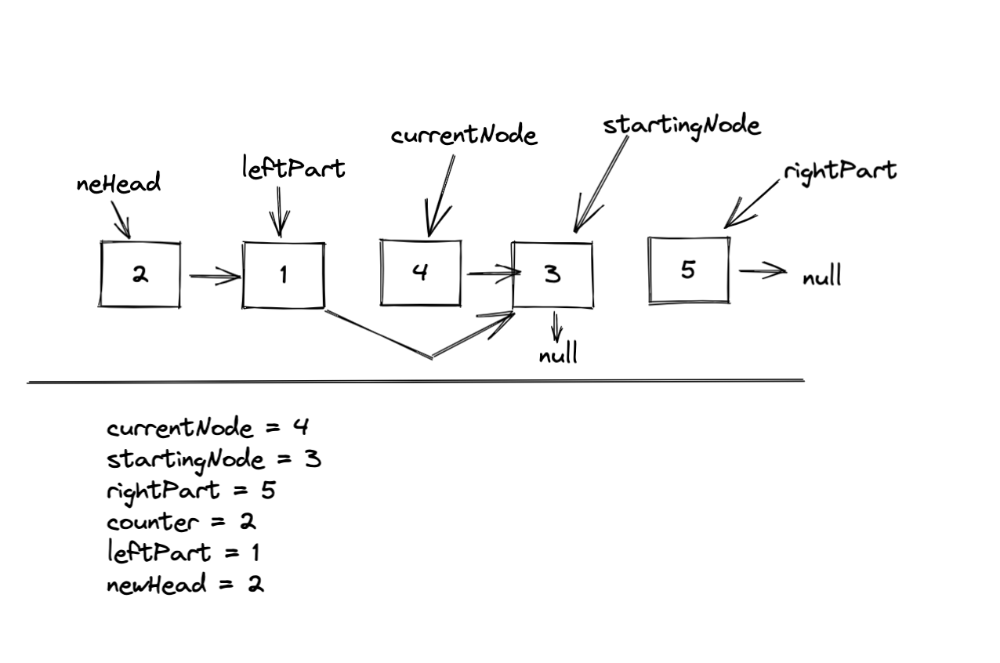

Re-connect the subList to the mainList, and reset for the next iteration.

```javascript 
leftPart.next = currentNode // connect the leftPart
startingNode.next = rightPart // connect the rightPart
leftPart = startingNode // set the next leftPart
startingNode = rightPart // set the next startingNode
currentNode = rightPart // set the next currentNode
counter = 1 // reset the counter
```

Resulting in...

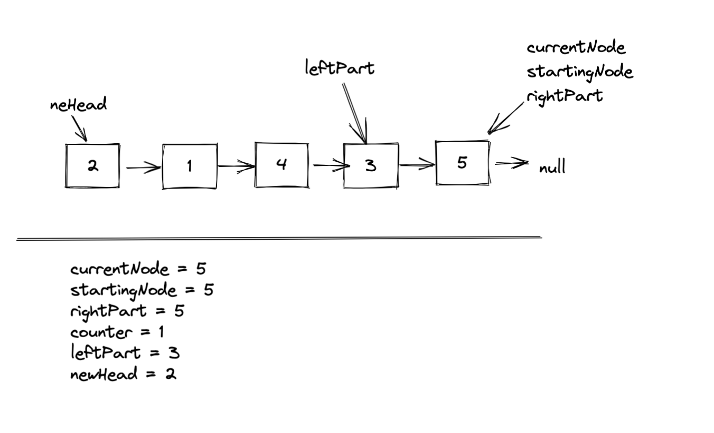

Nice, our process should handle all the intermediate subLists. Next, lets take a look at how things will be handled
at the end of the list. 

#### Handling the end of the list ####

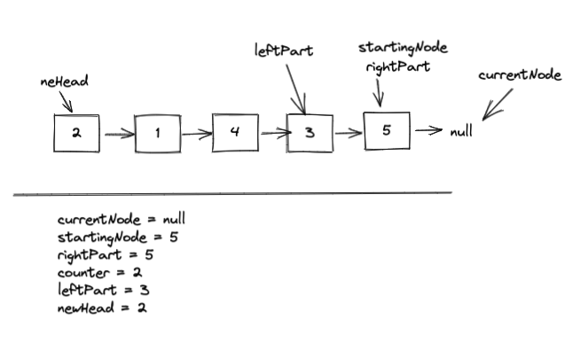

Here our counter equals 2 which equals k. With our current flow this would trigger our a subList reversal, 
however it shouldn't since this is not a true subList with length 2. To handle this case, we will only trigger our process if:

```javascript
if (currentNode !== null && counter === k)
```

Adding this will ensure that we get the desired behavior. Nice!


### The Algorithm Plan

**Edge case handling**
* If k === 1, return head. (Nothing needs to be processed in this case, return the list as is)

**Global variables**
* Declare leftPart initialize to null
* Declare newHead initialize to null
* Declare currentNode initialize to head
* Declare startingNode initialize to head
* Declare counter initialize to 1

**Main loop**
* Iterate through the list while currentNode !== null
* Increment the counter in each iteration
* If the counter === k and currentNode !== null
  * Declare rightPart, and initialize it to currentNode.next
  * Set currentNode.next to null to disconnect the list
  * Reverse the list from the startingNode
  * If there is no head, set it to currentNode
  * If there is a leftPart, connect it to currentNode
  * Set leftPart to startingNode
  * Set startingNode.next to rightPart
  * Set startingNode to rightPart
  * Set currentNode to rightPart
  * Set counter to 1
* Return newHead

Lets code it up!

### Code

```javascript

const reverseKGroup = (head, k) => {

    // Handle edge case
    if (k === 1) {
        return head;
    }

    let leftPart = null;
    let newHead = null;
    let currentNode = head;
    let startingNode = head;
    let counter = 1;

    while (currentNode) {
        currentNode = currentNode.next;
        counter++;
        if (currentNode && counter === k) {

            // Save right part for next iteration    
            let rightPart = currentNode.next;

            // Disconnect and reverse
            currentNode.next = null;
            reverse(startingNode);

            // Set newHead if needed
            if (newHead === null) {
                newHead = currentNode;
            }

            // Connect the list back
            if (leftPart !== null) {
                leftPart.next = currentNode;
            } 
            startingNode.next = rightPart;

            // Reset for the next iteration
            leftPart = startingNode;
            startingNode = rightPart;
            currentNode = rightPart;
            counter = 1;
        }
    }

    return newHead;
}

const reverse = (node) => {
    let prev = null;
    let currentNode = node;
    while (currentNode) {
        let nextNode = currentNode.next;
        currentNode.next = prev;
        prev = currentNode;
        currentNode = nextNode;
    }
    return prev; // returning for as a good practice, not needed in this problem
}

```

### Summary

This algorithm runs in O(n) time where n is the number of nodes in the list, and
O(1) space. 

As you can see the code is fairly trivial. It's very easy to get tripped up 
with all the different pointers that you have to keep track of. I sure did! 

Drawing this out and understanding that up front makes all the difference. Once you have a good 
mental model of the operations, coding this up is quite simple. In fact, I'd say that's probably 
true for most problems. 

Hope this was helpful!


